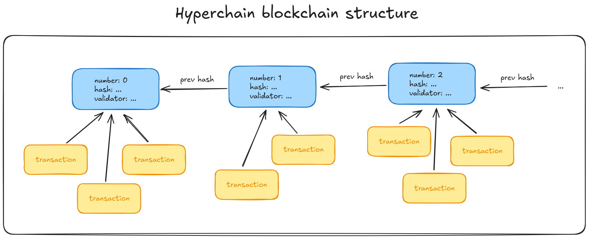
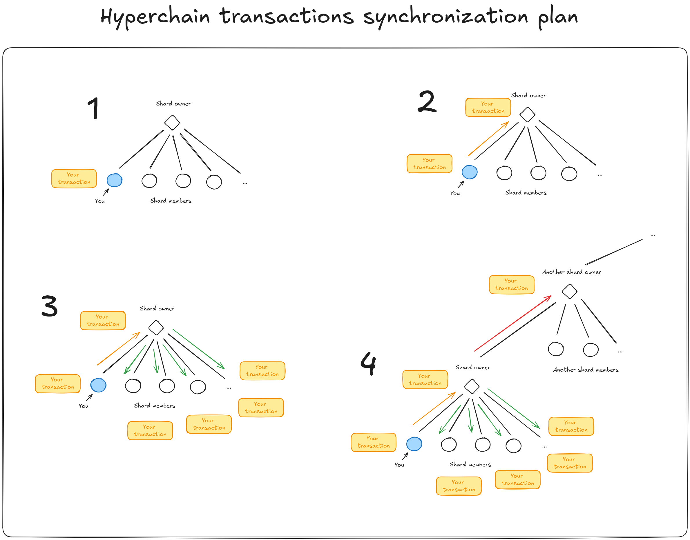

# Blockchain

## Purpose of the hyperchain

Hyperchain is a reference implementation of the PoA blockchain and considered a standard.
There can be many other implementations, incompatible with this paper. Though all the official
applications will refer to this paper.

Hyperchain is made with purpose to simplify creation of decentralized apps made within
the hyperborea project ecosystem. Blockchain architecture was chosen to allow distributed
storage of the approved data. Blocks are atomic and can be sent using the hyperborea inbox system.

Hyperchain is a PoA blockchain, meaning it has a central authority (or several ones) that approve
incoming information, form and digitally sign it in a form of data blocks. Blocks reference previous
ones, forming a chain (history). This history can be used to store data in the same order between
all the clients of some applications: for example, chat applications can use hyperchain to store
chat history. While at least 1 client has a copy of this blockchain the history will not be lost.

## Hyperchain blocks and transactions

Blocks are made by the blockchain's authority, while transactions are made by the clients of the blockchain.
Transactions are entities that form the block. They can contain an arbitrary data or can be some
standard types. Until transaction is stored in some block it is considered "staged". Staged transactions
form a "virtual block" - a block which is not stabilized (signed) yet. Transactions in virtual block
may have different order, and some of them may not be stabilized by the authority (filtered out).
Once transaction is stored in a block it is considered "stable". Order of stable transactions
is chosen by the blockchain authority. Since `created_at` value of transactions can be easily fabricated
authorities may not respect it and chose their own algorithm of determining order.

It is expected that each block can store many transactions. Blocks can be formed every N seconds
or when M transactions were received - it purely depends on the application which uses the hyperchain.
Blocks can be indexed by numbers instead of hashes because they're fewere than transactions.
In fact, transactions were made as well to allow blocks to have numbers.



## Hyperchain shards (mesh network)

To synchronize the state of the blockchain clients form a mesh network of "shards".
Shards consist of a "shard owner" and "shard subscribers". Every client can subscribe to every other
client and receive updates from it. When a client makes a transaction - it can be announced
to all the clients which are subscribed to this client, and to all the clients to which the current
client is subscribed. If client received a transaction announcement - this announcement can be
resent to the clients to which the current client is subscribed. This architecture allows
every client to keep a limited (and controllable) amount of persistent connections, while
keeping the whole network alive.

Eventually the blockchain's authority will receive the transaction announcement and process it.
Once new block is signed, it will be announced to all the clients which are subscribed to the
blockchain authority and to which it is subscribed, this spreading it eventually to all the other clients.

This architecture allows applications powered by the hyperchain to not to implement their own
communications protocol. Instead, they need to start a hyperborea client and use it
to subscribe to some of the other known clients which are online. Thanks to the shards architecture
you will become a part of the global communications network without any additional steps.
This is a really powerful mechanism which is highly recommended to use for your own applications.



## Transactions

```ts
// Base64 encoded arbitrary binary data
type TransactionBodyRaw = string;

type TransactionBodyMessage = {
    // Base64 encoded public key of the message author
    from: string,

    // Base64 encoded public key of the message receiver
    to: string,

    // Message encoding format defined in the hyperborea v1 standard
    // Example value: `base64/chacha20-poly1305/brotli`
    format: string,

    // Encoded content of the message
    content: string
};

type TransactionBodyAnnouncement = {
    // Base64 encoded public key of the announcement author
    from: string,

    // Message encoding format defined in the hyperborea v1 standard
    // Example value: `base64/chacha20-poly1305/brotli`
    format: string,

    // Encoded content of the announcement
    // If encryption is used in the format, then the key is calculated
    // from the `from` value by applying ECDH to it (hyperborea v1 standard).
    content: string
};

type TransactionBody =
    | { type: 'raw',          body: TransactionBodyRaw          }
    | { type: 'message',      body: TransactionBodyMessage      }
    | { type: 'announcement', body: TransactionBodyAnnouncement };

type Transaction = {
    format: 1,
    transaction: {
        // Base64 encoded hash of the transaction
        hash: string,

        // Transaction's metadata
        metadata: {
            // Random unsigned integer (uint64) to make transactions
            // with similar content have different hashes
            random_seed: number,

            // UTC timestamp at which this transaction was made
            created_at: number
        },

        // Transaction's content
        content: {
            // Base64 encoded public key of the transaction author
            author: string,

            // Body of the transaction
            body: TransactionBody,

            // base64 encoded sign of the transaction's hash
            sign: string
        }
    }
};
```

## Blocks

```ts
type BlockMinter = {
    format: 1,
    minter: {
        // Base64 encoded public key of the minter
        public_key: string,

        // Base64 encoded balance mask of the minter
        //
        // Balance mask is calculated by XOR-ing hashes of blocks
        // that were made thanks to the minter, starting with [1111..111] hash value
        //
        // Mask is needed to validate the number of used and available "stocks"
        // of the minter. Stocks can be used as a form of digital currency
        //
        // `balance_mask` contains value *after* applying the block's hash to it
        balance_mask: string
    }
};

type Block = {
    format: 1,
    block: {
        // Base64 encoded hash of the previous block,
        // or null if it's the root block of the blockchain
        previous: string | null,

        // Base64 encoded hash of the current block
        current: string,

        // Number of the current block
        // The root block must have the number 0
        // Further blocks must increment this value by 1
        number: number,

        // Block's metadata
        metadata: {
            // Random unsigned integer (uint64) to make blocks
            // sustainably random. Technically not needed but I
            // decided to keep this value
            random_seed: number,

            // UTC timestamp at which this block was made
            created_at: number
        },

        // Block's content
        content: {
            // List of transactions which were approved (stabilized)
            // by this block
            transactions: Transaction[],

            // List of clients which participated in this block's creation
            minters: BlockMinter[],

            // Base64 encoded public key of the block's author
            validator: string,

            // Base64 encoded sign of the block's hash
            sign: string
        }
    }
};
```

# Shards API

## Members type

```ts
type ShardMember = {
    // Base64 encoded public key of the client
    client_public: string,

    // Address of the hyperborea server to which
    // the client is connected
    server_address: string
};
```

## Message types

Messages are sent using the hyperborea inbox system.

| Message       | Description                                                    |
| ------------- | -------------------------------------------------------------- |
| `subscribe`   | Subscribe to the shard (ask to send announcements)             |
| `unsubscribe` | Unsubscribe from the shard (ask to stop sending announcements) |
| `heartbeat`   | Keep alive message to persist your connection to the shard     |
| `update`      | Shard update message (announcement, status update, etc.)       |

```ts
type ShardMessageType = 'subscribe' | 'unsubscribe' | 'heartbeat' | 'update';

type ShardMessage = {
    format: 1,

    // Type of the message
    type: ShardMessageType,

    // Body of the update message
    // Set only if type is `update`
    body?: ShardUpdate
};

type ShardUpdate =
    | StatusUpdate
    | AnnounceBlocksUpdate
    | AnnounceTransactionsUpdate
    | AskBlocksUpdate
    | AskTransactionsUpdate;
```

## `StatusUpdate`

Status updates should be sent by every shard member and shard owner itself to synchronize state of the shard.
Implementations of the shards can use this data to reduce data duplication.

```ts
type StatusUpdate = {
    format: 1,
    type: 'status',
    body: {
        // Known blockchain blocks
        blocks: {
            // First known block, or null if none of blocks are known
            root: Block | null,

            // Last known block, or null if none of blocks are known
            tail: Block | null
        },

        // List of base64 hashes of known staged transactions
        // Staged transactions are those which are not yet stored
        // in the blocks of blockchain
        transactions: string[],

        // Announced list of shards to which the current client is subscribed
        subscriptions: ShardMember[],

        // Announced list of shard members which are subscribed to the current client
        subscribers: ShardMember[]
    }
};
```

## `AnnounceBlocksUpdate`

Initial blocks announcements happen when the blockchain's authority publishes
new blocks. Shards can send blocks announcements to members (or members to owners)
to fulfill their knowledge and synchronize state of the shard.

```ts
type AnnounceBlocksUpdate = {
    format: 1,
    type: 'announce_blocks',
    blocks: Block[]
};
```

## `AnnounceTransactionsUpdate`

Transactions are made by blockchain users and distributed via shards. Initial announcements
are made by the client that made the new transaction. Further announcement messages are
duplicated by the shard owners and sent deeper to the network. Eventually transactions
will be synchronized by the whole network and reach its authority, making it stable.

```ts
type AnnounceTransactionsUpdate = {
    format: 1,
    type: 'announce_transactions',
    transactions: Transaction[]
};
```

## `AskBlocksUpdate`

Ask shard member or owner to send blocks in given period.

```ts
type AskBlocksUpdate = {
    format: 1,
    type: 'ask_blocks',
    body: {
        // Number of the first asked block
        from_number: number,

        // Maximum amount of blocks to receive
        // If null, then all the available ones
        max_amount: number | null
    }
};
```

## `AskTransactionsUpdate`

Ask shard member or owner to send transactions with given hashes.

Hashes can be obtained from the `StatusUpdate` messages.

```ts
type AskBlocksUpdate = {
    format: 1,
    type: 'ask_transactions',

    // List of base64 encoded hashes of asked transactions
    hashes: string[]
};
```
